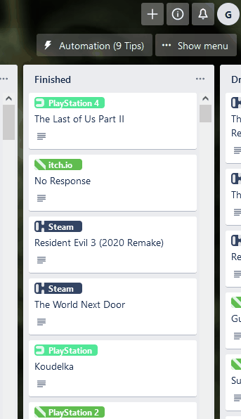
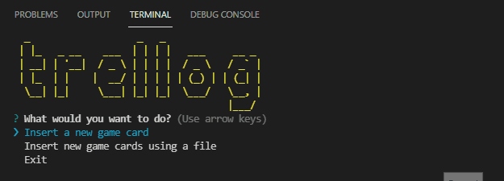
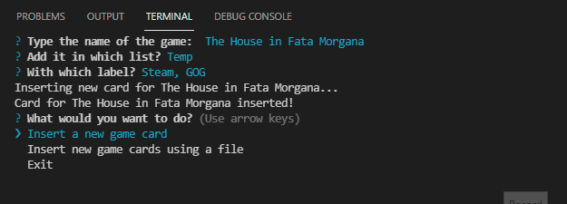
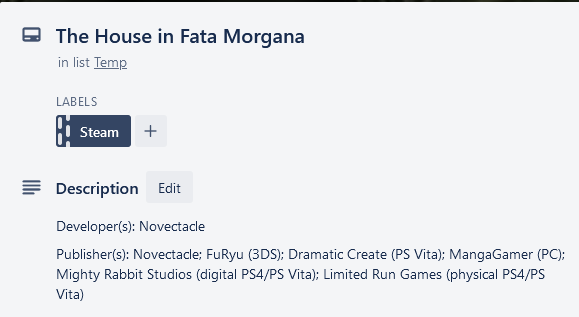

# trellog


> A CLI to add new game-related cards to your Trello board.


## Prerequisites

Before running this CLI, you'll need to install:

- [NodeJS](https://nodejs.org/en/)
- [Yarn](https://yarnpkg.com/) or [npm](https://www.npmjs.com/)

Also, suffice to say, you will need a Trello board to operate on.


## Setup

To install the project dependencies, run:

```bash
npm install
```

Or, in case you're using `yarn`:

```bash
yarn install
```


## .env file

You will need a `.env` file with the following content:

```env
TIMEOUT=
TRELLO_API_KEY=
TRELLO_API_TOKEN=
TRELLO_BOARD_ID=
```

Where:

- `TIMEOUT` is the general request timeout in miliseconds
- `TRELLO_API_KEY` is your Trello API key
- `TRELLO_API_TOKEN` is your Trello API token
- `TRELLO_BOARD_ID` is your board id

To generate your API key and token, click [here](https://trello.com/app-key). To get a board id, just generate a JSON file through your own board menu on Trello and copy the content from the `id` property (like the demo below).




## Running and using the application

### Running the application
With the dependencies installed, just run:

```bash
npm run start

```

Or:


```bash
yarn start

```

### Using the application

You have two ways of adding new cards to your board. The first way is to add one single card, choosing the first option from the main menu. When using this option, the following will happen:

- An input prompt will show up for you to type the game's name
- In the next menu you need to choose in which list to place your card
- After that, you just choose the labels you want to put on it (in this section, you can choose zero or more)

After that, your card will be generated and sent to your Trello board.



*The lists and labels are loaded from your board.*

The second way is to choose the second option in the main menu. To use this option you will need:

- A list with the `Temp` name on your board
- A file with all the games you want to add listed like the following

```text
game 1
game 2
...
```

- The file need to be, at least, in the project's root directory

After choosing this option a menu will ask for you to choose the file where the games are listed. After choosing the file, just wait until the process is done.



*For the time being, there's no option to add labels and choosing a diferent list to add your cards on when using this option.*

The restulted card should be like this:




## License

The project license can be found [here](./LICENSE).